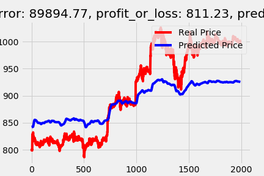

# Tradium Engine

### TSLA Prediction

#### Reference:

## Some helpful python commands
* `pipreqs --print --force .  | sort > requirements.txt`  --to list used python packages in ascending order
* `conda env export > conda_env_37.yml` --to export conda environment to a yml file
* `brew install openssl readline sqlite3 xz zlib`  --to install pyenv dependencies
* `curl https://pyenv.run | bash` --to install pyenv,for managing diff versions of python
